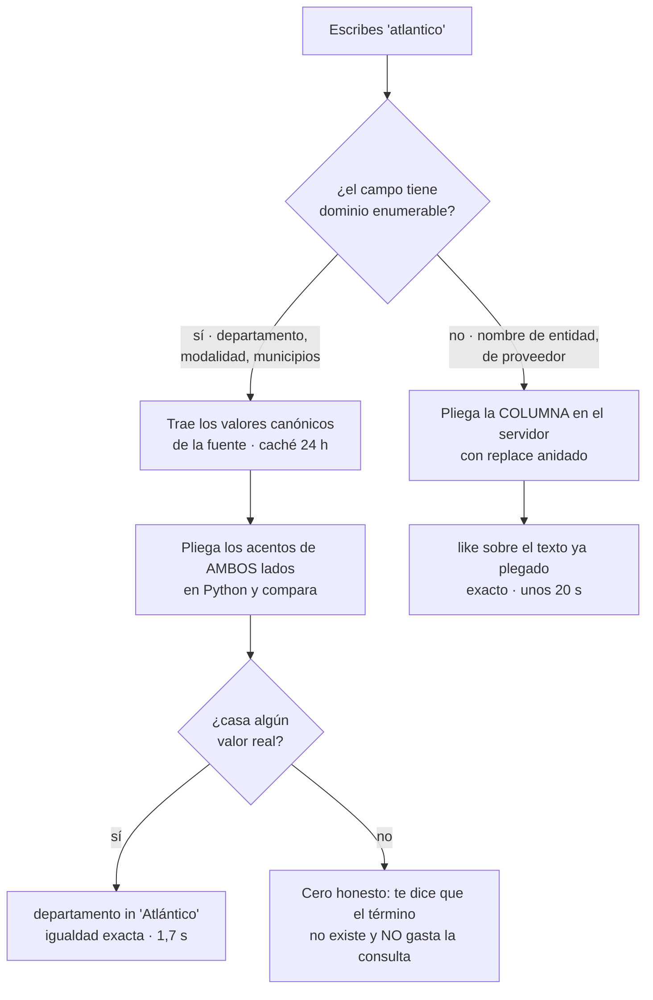

# colombia-datos-mcp

Servidor MCP para datos públicos de Colombia: catálogo nacional de
`datos.gov.co`, contratación pública (SECOP) y división territorial (DIVIPOLA).
13 herramientas, sin credenciales.

Esta es la **fase F0 + la mitad Socrata de F1** del diseño: núcleo completo,
adaptador de Socrata y los módulos de catálogo, SECOP y DIVIPOLA.

> **Si vas a citar una cifra de aquí, lee
> [Antes de citar una cifra](#antes-de-citar-una-cifra).** Estos datos tienen
> trampas que no se ven: contratos en borrador que suman, unidades de análisis
> que no se pueden mezclar y montos sin deflactar.

## Instalación

```bash
pip install -e .
```

```bash
colombia-datos-mcp                      # stdio
colombia-datos-mcp --http --port 8080   # streamable HTTP
```

Requiere Python 3.11 o superior.

## Configuración en el cliente MCP

Claude Desktop o Claude Code:

```jsonc
{ "mcpServers": { "colombia-datos": {
    "command": "colombia-datos-mcp",
    "env": { "SOCRATA_APP_TOKEN": "opcional" } } } }
```

En Windows conviene apuntar al ejecutable con ruta absoluta
(`...\Scripts\colombia-datos-mcp.exe`): el cliente MCP no siempre hereda el
mismo `PATH` que tu terminal.

**No requiere credenciales.** `SOCRATA_APP_TOKEN` es opcional; sin él Socrata
limita por IP y el servidor lo advierte una vez en el sobre. El token viaja por
cabecera, nunca por query string, así que no aparece en logs ni en la URL
reproducible.

### Variables de entorno

Todas son opcionales y tienen valores conservadores.

| Variable | Defecto | Qué controla |
|---|---|---|
| `SOCRATA_APP_TOKEN` | — | Cuota propia en Socrata. Un token inválido produce `[CONFIG]`, no degradación silenciosa. |
| `CO_PRESUPUESTO_TOKENS` | `6000` | Tamaño máximo de respuesta antes de recortar filas. |
| `CO_TTL_DATOS` | `900` (15 min) | TTL de la caché en memoria. |
| `CO_TTL_METADATOS` | `86400` (24 h) | TTL de esquemas y dominios categóricos, en disco. |
| `CO_CACHE_DIR` | `~/.cache/colombia-datos-mcp` | Dónde vive la caché L2. |
| `CO_EXPORT_DIR` | `~/colombia-datos-export` | Único directorio donde `co_datos_exportar` puede escribir. |
| `CO_REQ_POR_SEGUNDO` | `5` | Autolímite por host. |
| `CO_MAX_REINTENTOS` | `4` | Intentos por petición antes de rendirse. |
| `CO_USER_AGENT` | `colombia-datos-mcp/<versión> (+URL del repo)` | Identificación ante la fuente. |

## Qué devuelve: un ejemplo real

Pidiendo `co_geo_divipola(consulta="Itagui", limite=2)` —sin tilde, a propósito—
la respuesta completa es:

```markdown
| cod_dpto | departamento | cod_mpio | municipio | tipo | lon | lat |
|---|---|---|---|---|---|---|
| 05 | ANTIOQUIA | 05360 | ITAGÜÍ | Municipio | -75.612056 | 6.175079 |

**1 fila(s)** de **1** coincidencias · orden: `cod_mpio`

Fuente: `gdxc-w37w` DIVIPOLA - Códigos municipios · CC BY-SA 4.0

Consulta reproducible: https://www.datos.gov.co/resource/gdxc-w37w.json?%24where=nom_mpio+in+%28%27ITAG%C3%9C%C3%8D%27%29&%24order=cod_mpio&%24limit=2

> Los códigos DIVIPOLA son texto con ceros a la izquierda: consérvalos como string.
```

Todo lo que hay debajo de la tabla es **el sobre**, y es parte del contrato:

| Línea | Para qué sirve |
|---|---|
| `1 fila(s)` de `1` coincidencias | Si los dos números son iguales tienes el conjunto completo y puedes sumar. Si difieren, **estás viendo una parte**. |
| `orden: cod_mpio` | Sin orden declarado, «los 20 primeros» no significa nada. |
| `Fuente` + licencia | La atribución que debes propagar si republicas. |
| `Consulta reproducible` | El SoQL exacto que se ejecutó. Pégalo en el navegador y verifica: **es la prueba**. |
| Líneas con `>` | Advertencias del servidor. No son decorativas. |

Fíjate en la URL: escribí «Itagui» y el filtro salió `nom_mpio in ('ITAGÜÍ')`. Eso
es la resolución de nombres funcionando — ver
[Cómo se comparan los nombres](#cómo-se-comparan-los-nombres).

## Herramientas

| Herramienta | Qué hace |
|---|---|
| `co_datos_buscar_datasets` | Catálogo nacional; traduce siglas de entidad a la cadena de atribución exacta |
| `co_datos_describir_dataset` | Esquema en vivo: campo técnico + nombre legible + tipo + descripción |
| `co_datos_consultar` | SoQL con allow-list de columnas; `detalle` = conteo / resumen / completo |
| `co_datos_agregar` | Agrupa del lado del servidor |
| `co_secop_buscar_contratos` | Contratos de SECOP II |
| `co_secop_buscar_procesos` | Procesos de contratación |
| `co_secop_detalle_contrato` | Vista compuesta: contrato + adiciones + URL pública |
| `co_secop_perfil_proveedor` | Perfil agregado por cédula o NIT |
| `co_secop_resolver_entidad` | Nombre coloquial → nombre canónico + NIT |
| `co_secop_agregar` | Totales por departamento, entidad, modalidad, proveedor… |
| `co_geo_divipola` | Códigos y coordenadas de departamentos, municipios y centros poblados |
| `co_geo_cotejar_coordenadas` | Control de calidad entre las dos fuentes oficiales de coordenadas |
| `co_datos_exportar` | Descarga un filtro entero a CSV, JSON o Parquet en disco |

Más tres *resources*: `co://secop/datasets`, `co://secop/joins`,
`co://atribuciones`.

**Parámetros, topes y advertencias de cada una:
[docs/herramientas.md](docs/herramientas.md).** Secuencias que funcionan, con sus
trampas: [docs/recetas.md](docs/recetas.md).

## Antes de citar una cifra

Esto es lo que el servidor **no puede decidir por ti**. Son ocho reglas, y
saltárselas produce cifras que parecen correctas y no lo son.

**1. Comprueba `devueltos` contra `total`.** Si el sobre dice «20 filas de 4.312
coincidencias», sumar esas 20 no da el total de nada. Usa una herramienta de
agregación. El servidor te lo advierte, pero no puede impedírtelo.

**2. Cuenta antes de traer.** `detalle="conteo"` cuesta ~200 tokens y te dice si
el filtro está bien antes de gastar miles en filas.

**3. No mezcles unidades de análisis.** Un contrato no es un proceso, y una
adición no es un contrato: hay **26,1 M de adiciones para ~5,9 M de contratos**.
Cada respuesta declara su unidad; sumar filas de dos datasets distintos produce
un número sin significado.

**4. Los contratos en `Borrador` están en el dataset y suman.** No están
firmados —no traen `fecha_de_firma` y su `valor_pagado` es 0—, pero cuentan en
`sum(valor_del_contrato)`. Si lo que te interesa es contratación real, filtra por
estado. En un caso real que motivó esta nota, el borrador era $93.192.634 de un
total de $547.285.071: un **17 %** de la cifra que se habría citado.

**5. Desconfía de cualquier suma de `valor_del_contrato`.** SECOP contiene
**3.452 contratos por encima del billón de pesos**. El mayor son 881,8
*trillones* —unas 560.000 veces el PIB de Colombia— para una institución
universitaria: errores de digitación que arrastran cualquier total en el que
caigan. Medido sobre el dataset completo: esos 3.452
registros aportan el **99,99998 %** de la suma de los 5,96 M de contratos. Los
otros 5.955.101 contratos —los reales— suman $997,5 billones entre todos, que
es la cifra utilizable. Las herramientas de agregación ahora lo advierten con
los números del filtro que hayas pedido, pero la decisión de excluirlos es tuya.

**6. Los montos son nominales y sin deflactar.** Comparar $575.132 de 2018 con
$93 millones de 2026 no dice nada por sí solo.

**7. Confirma que un nombre es una sola persona.** Dos personas distintas con el
mismo nombre se mezclan sin aviso. Agrupa por `documento_proveedor` antes de dar
un total por nombre; si sale más de una cédula, son varias personas.

**8. Casi todo es solo SECOP II.** Para contratación anterior a la plataforma hay
que consultar también `rpmr-utcd` (SECOP Integrado). Un «cero contratos» puede
significar «no está en SECOP II», no «no contrató nunca».

Y una que el servidor sí garantiza: **cero filas nunca es lo mismo que fuente
caída.** Son mensajes distintos a propósito. Un `[FUENTE_CAIDA]` no significa
«no hay datos», y una tabla vacía no es un fallo.

## Extraer los datos

Tres vías, según lo que quieras hacer con ellos.

**Contenido estructurado, en cada respuesta.** Además del markdown, toda
herramienta devuelve por el canal estructurado del protocolo un objeto con
`datos` —las filas ya tipadas: las coordenadas son `float`, no texto— y `_meta`
con el total, el orden, las advertencias y la URL reproducible. Un cliente MCP
puede consumirlas como datos sin volver a parsear la tabla.

**`formato` para copiar y pegar.** Las herramientas de consulta aceptan
`formato="csv"` o `"json"`; el cuerpo sale en un bloque cercado para que se
copie limpio, y el sobre sigue debajo con su procedencia.

```
co_secop_buscar_contratos(departamento="Chocó", formato="csv")
```

**`co_datos_exportar` para volúmenes.** Pagina hasta agotar el filtro y escribe
el fichero, así que sirve para lo que no cabe en una respuesta. Devuelve la ruta,
el número de filas y si el conjunto quedó completo.

```
co_datos_exportar(dataset_id="jbjy-vk9h", nombre_archivo="contratos_choco",
                  donde="departamento = 'Chocó'", formato="csv")
```

Es la **única herramienta que escribe** y está anotada como tal, para que el
cliente pueda pedirte confirmación. `nombre_archivo` es un nombre, no una ruta:
el fichero se escribe siempre bajo `CO_EXPORT_DIR`, y cualquier intento de salir
de ahí se neutraliza. El CSV lleva BOM para que Excel respete los acentos; con
pandas usa `encoding="utf-8-sig"`.

## Gráficas

Las agregaciones traen una columna de barras proporcionales a la métrica, para
comparar los grupos sin salir de la terminal. Municipios por departamento:

```
co_datos_agregar(dataset_id="gdxc-w37w", agrupar_por="dpto", limite=6)
```

```markdown
| dpto | total | gráfica |
|---|---|---|
| ANTIOQUIA | 125 | ████████████████ |
| BOYACÁ | 123 | ███████████████▊ |
| CUNDINAMARCA | 116 | ██████████████▉ |
| SANTANDER | 87 | ███████████▏ |
| NARIÑO | 64 | ████████▎ |
| TOLIMA | 47 | ██████ |
```

Todas comparten escala —eso es lo que las hace comparables— y usan bloques de un
octavo, así que 87 y 64 se distinguen sin leer los números. Un valor no numérico
deja la celda vacía en vez de dibujar una barra de cero. Se apagan con
`grafica=false` y no aparecen si pides `formato="csv"` o `"json"`.

### Cuando la gráfica delata el dato

Las mismas barras sobre `metrica="valor"` en SECOP dan esto:

```
co_secop_agregar(agrupar_por="departamento", metrica="valor", limite=3)
```

```markdown
| departamento | contratos | valor total | gráfica |
|---|---|---|---|
| Antioquia | 563.810 | $4.712.182.461.396.660.781.056 | ████████████████ |
| Distrito Capital de Bogotá | 2.002.976 | $216.174.625.284.825.972.736 | ▊ |
| Arauca | 25.550 | $48.653.538.638.823.145.472 | ▏ |
```

Bogotá tiene **cuatro veces más contratos** que Antioquia y una barra veinte
veces menor. Eso no es un fallo de dibujo: es la regla 5 hecha visible. Fue así
como aparecieron los 3.452 contratos con valores imposibles, y por eso ahora la
respuesta trae el aviso con las cifras del filtro.

Una gráfica que no cuadra con lo que sabes del mundo es información, no ruido.

## Cómo se comparan los nombres

Es la pieza menos obvia del servidor, y nació de un defecto medido.

Las columnas **categóricas de la fuente conservan los acentos** —`departamento`
es `Atlántico`, `nom_mpio` es `MEDELLÍN`—, y SoQL no tiene `unaccent()`: su
`like` distingue acentos. La estrategia se elige por la cardinalidad del campo:

| Caso | Estrategia | Por qué |
|---|---|---|
| Dominio enumerable (`departamento`, `modalidad`, municipios) | Se traen los valores canónicos (cacheados 24 h), se resuelve el término en Python y se filtra con `in ('Atlántico')` | Exacto, y compara por igualdad: 1,7 s frente a 7-20 s |
| Texto libre (`nombre_entidad`, `proveedor_adjudicado`) | El plegado se hace **en el servidor**, con `replace()` anidado sobre la columna | No hay lista que enumerar; exacto y de coste constante en la longitud del término |



La rama de la izquierda es la que faltaba antes: un término que no corresponde a
ningún valor real no se consulta, se explica. Un cero silencioso es
indistinguible de «no hay datos».

Se descartaron dos alternativas por medición contra los 1.122 municipios reales,
no por intuición: los comodines sobre las vocales alcanzaban el 100 % de recall
pero contaminaban el 32 % de las consultas —«ANDES» casaba con «CALDAS»—, y un
solo comodín por posición bajaba el ruido al 18 % pero perdía los nombres con dos
tildes («ITAGÜÍ», «EL PEÑÓN»). Las tres mediciones están en
`tests/test_texto.py`.

En la práctica: **escribe los nombres con tilde o sin ella, da igual.**

Lo que sí importa es el **orden de las palabras**: el filtro busca la cadena
completa como subcadena. Si la fuente guarda `CHAPARRO CARMONA JHON SEBASTIAN` y
buscas el nombre en orden natural, obtienes cero. Si un nombre de persona da
cero, prueba solo con los apellidos.

## Qué hace distinto

**El contrato de respuesta.** Toda respuesta trae el sobre del ejemplo de arriba,
con la URL exacta reproducible.

**Presupuesto de tokens con degradación explícita.** Si la respuesta no cabe, se
recorta y se marca `truncado: true` con instrucciones de qué hacer. Nunca hay
truncamiento silencioso.

**Paginación honesta.** `siguiente_offset` se calcula sobre lo realmente
devuelto, nunca sobre lo descargado. Y el orden estable se fuerza ya en la
primera página: si la página 1 no tiene orden, la 2 no puede tenerlo.

**Errores tipados.** `[VALIDACION]`, `[FUENTE_CAIDA]`, `[LIMITE_TASA]`,
`[NO_ENCONTRADO]`, `[TIMEOUT]`, `[CONFIG]`, cada uno con una sugerencia
accionable.

**Esquema en vivo, nunca cableado.** Las columnas se validan contra el esquema
real; un campo inexistente se rechaza listando los válidos.

**Cero honesto.** Cuando un término categórico no existe en la fuente, el
servidor lo dice con esas palabras y **no gasta la consulta**. Una tabla vacía es
indistinguible de «no hay datos».

## Trampas de la API que el servidor absorbe por ti

No tienes que hacer nada con esta lista: está aquí para que se sepa qué hay
debajo, y porque cada punto costó una verificación contra la fuente viva.

- `search_context` es obligatorio en la Discovery API o `categories`/`tags`
  devuelven **0 en silencio**.
- El facet `attribution` solo acepta la cadena literal completa.
  `attribution=DANE` da cero; hay que usar `Departamento Administrativo Nacional
  de Estadísticas - DANE, Bogotá D.C.` — con «Estadísticas» en plural, que no es
  el nombre real de la entidad.
- `$order` es obligatorio al paginar o se pierden y duplican filas. Pero **no se
  puede ordenar por `:id` una consulta agregada**: Socrata responde «Column
  ':id' is not in group by».
- Los números llegan como **string**; los códigos DIVIPOLA son texto con ceros a
  la izquierda (`05`, `08`). Tratarlos como enteros rompe todos los joins.
- **Socrata omite los campos nulos** en vez de mandarlos vacíos, así que dos
  filas del mismo dataset llegan con juegos de claves distintos. Deducir las
  columnas de la primera fila perdía datos en silencio.
- Los acentos vienen destruidos en origen **solo en el texto libre**
  (`descripcion` trae `EJECUCIoN`); las columnas categóricas los conservan. Dar
  por buena la primera mitad y aplicarla a todo dejaba 392 de 1.122 municipios,
  12 de 33 departamentos y ~2,8 M de contratos inalcanzables por nombre.
- **SoQL sí soporta `replace()` anidado.** Una prueba con `curl` sugería lo
  contrario, pero era el shell corrompiendo el acento, no la API.
- **Coordenadas:** en `xaxy-8nri` exactamente un registro de 8.161 —Medellín—
  trae separador de miles (`-75,581,775`), y `float(s.replace(",", "."))` **lanza
  `ValueError`** sobre él. `core/coords.py` aplica «la primera coma es el
  decimal» y valida contra la caja envolvente del país. Cuidado: esa regla es
  correcta para coordenadas y **falsa para dinero**, donde `1.000.000` es un
  millón.
- Las «modificaciones contractuales» se llaman **Adiciones**; buscar
  «modificaciones» en el catálogo devuelve cero.
- Varias entidades se registran en SECOP con su **sigla y nada más**: INVIAS y
  UNGRD figuran así, y expandirlas a su razón social da cero. **RTVC** no está en
  el dataset de contratos con ningún nombre, solo en SECOP Integrado.
- Las columnas de fecha del Plan Anual de Adquisiciones (`9sue-ezhx`) son de tipo
  `text`, no `calendar_date`: no se filtran con `between`.

## Lo que este servidor NO hace

Explícito para que nadie lo dé por hecho:

- **No degrada entre niveles de detalle.** Ante una respuesta grande recorta
  filas; no baja de `completo` a `resumen` por su cuenta.
- **No tiene motor de privacidad**, y por tanto no incluye los módulos de
  seguridad y DDHH que dependían de él.
- **No cubre Banco de la República ni IGAC / MGN del DANE**: faltan los
  adaptadores SDMX y ArcGIS.
- `ESQUEMA_CAMBIADO`, `FUERA_DE_JURISDICCION` y `PRIVACIDAD` están definidos como
  errores pero **ningún camino de código los lanza todavía**.

Detalle en [docs/arquitectura.md](docs/arquitectura.md#lo-que-todavía-no-hace).

## Si editas el código

El cliente MCP lanza el servidor como un proceso hijo de larga vida, y **Python
no recarga módulos en caliente**. Un proceso arrancado antes de tu cambio seguirá
ejecutando el código viejo indefinidamente, aunque la instalación sea editable y
las pruebas pasen.

Para confirmarlo, mira la `Consulta reproducible` del sobre: muestra el SoQL que
el proceso generó de verdad. Si esperabas un `replace(replace(...))` y ves un
`upper(campo) like '%…%'` plano, el proceso es anterior al arreglo.

La solución es reiniciar la sesión del cliente MCP. Más detalle y otros síntomas
—incluido el `WinError 32` al reinstalar en Windows— en
[docs/operacion.md](docs/operacion.md).

## Pruebas

```bash
pip install -e ".[dev]"
```

```bash
pytest              # 105 pruebas, sin red
```

```bash
pytest -m contrato  # 13 pruebas contra la API viva (~5 min)
```

Las fixtures son respuestas **reales** capturadas de la API el 18-ago-2026, con
sus defectos intactos: coma decimal, separador de miles en Medellín, números como
string. Una fixture idealizada esconde el bug — el defecto de los acentos
sobrevivió a 54 pruebas porque las fixtures tenían las tildes bien puestas.

La suite de contrato comprueba los supuestos sobre los que está construido el
código: que DIVIPOLA y SECOP siguen acentuando, que SoQL sigue aceptando
`replace()` anidado, que los alias curados siguen resolviendo, que el registro
envenenado de Medellín sigue ahí, que los IDs no rotaron. Corre a diario en CI y
**su fallo no es un bug del servidor: es la señal de que el Estado cambió el
esquema.**

## Documentación

| Documento | Para qué |
|---|---|
| [docs/herramientas.md](docs/herramientas.md) | Las 12 herramientas: parámetros, valores por defecto y topes. |
| [docs/recetas.md](docs/recetas.md) | Secuencias que funcionan, con las trampas de cada una y cómo leer el sobre. |
| [docs/fuentes.md](docs/fuentes.md) | Los 11 datasets: unidad de análisis, campos clave, joins y atribuciones. |
| [docs/arquitectura.md](docs/arquitectura.md) | Cómo está construido, y qué **no** hace todavía. |
| [docs/operacion.md](docs/operacion.md) | Diagnóstico: caché, throttling, timeouts, y por qué el servidor no recoge tus cambios. |
| [CONTRIBUTING.md](CONTRIBUTING.md) | Las capas de prueba y cómo añadir un dataset o un filtro. |
| [CHANGELOG.md](CHANGELOG.md) | Qué cambió en cada versión. |

## Estado y siguiente paso

Implementado: núcleo (sobre, presupuesto, caché de dos niveles, HTTP con
autolímite y circuit breaker, errores tipados, coordenadas), adaptador Socrata,
comparación de nombres tolerante a acentos, y los módulos de catálogo, SECOP y
DIVIPOLA. CI con las pruebas sin red en Python 3.11-3.13 y el contrato programado
a diario.

Pendiente, en orden: adaptador SDMX para Banco de la República, adaptador ArcGIS
(IGAC / MGN del DANE) con descubrimiento dinámico del corte vigente, el motor de
privacidad, y solo después los módulos de seguridad y DDHH.

## Licencia y atribución

Código bajo licencia MIT.

Los datos son de la Nación y se publican bajo **CC BY-SA 4.0**: si los
redistribuyes, propaga la atribución. Cada respuesta del servidor la trae en el
sobre, junto con la URL reproducible.
