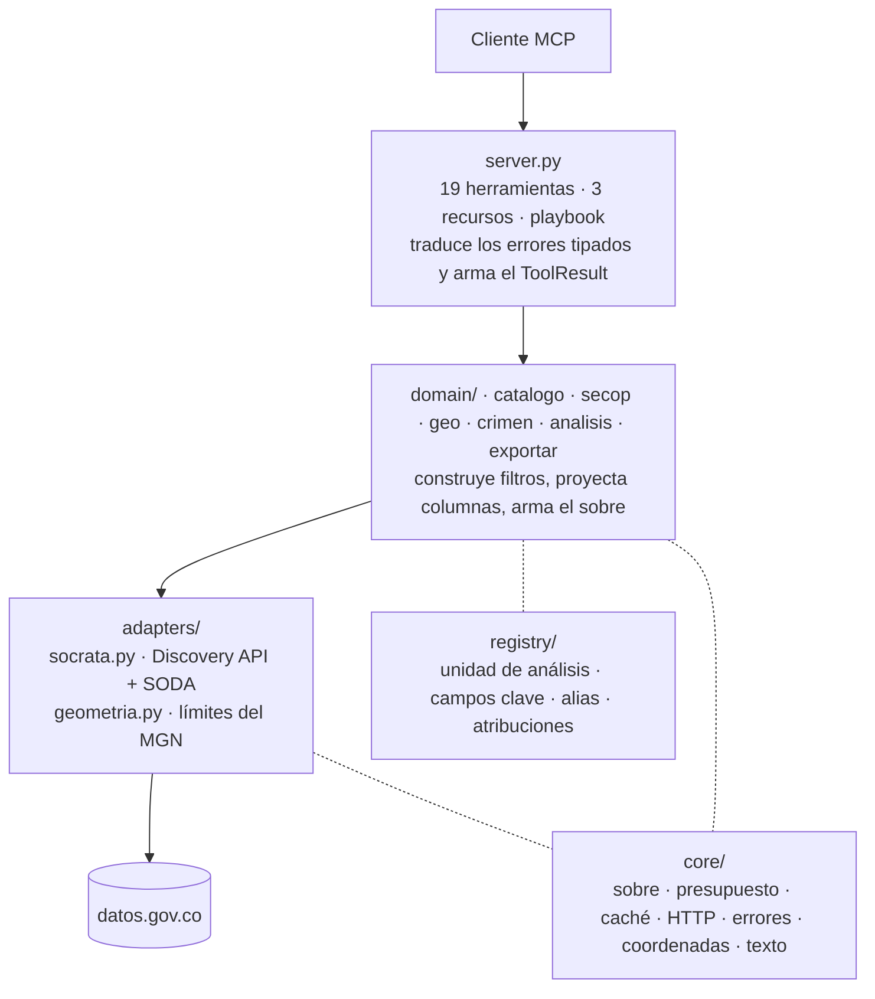
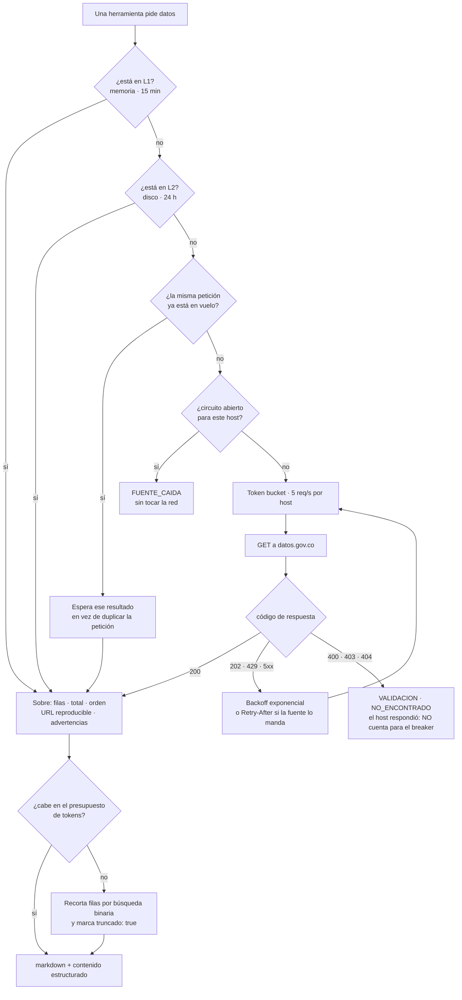

# Arquitectura

Tres capas y una regla: **el dominio no habla HTTP y el adaptador no sabe de
SECOP**.

La flecha continua es la petición; la punteada, de qué se apoya cada capa. El
dominio nunca llama a `httpx` y el adaptador nunca sabe qué es un contrato.

| Módulo | Responsabilidad |
|---|---|
| `core/envelope.py` | El sobre: metadatos honestos alrededor de cada respuesta. |
| `core/budget.py` | Presupuesto de tokens y degradación explícita. |
| `core/cache.py` | Caché L1 en memoria + L2 en disco, con deduplicación en vuelo. |
| `core/http.py` | Autolímite por host, backoff, circuit breaker, errores tipados. |
| `core/errors.py` | Jerarquía de errores con código estable y sugerencia accionable. |
| `core/coords.py` | Saneamiento de coordenadas de DIVIPOLA. |
| `core/format.py` | Markdown, moneda es-CO, fechas, mojibake. |
| `core/texto.py` | Plegado y comparación de nombres contra fuentes acentuadas. |
| `registry/datasets.py` | IDs, unidad de análisis, campos clave, alias, atribuciones. |
| `adapters/geometria.py` | Límites del MGN, con validación de forma y caché en disco. |
| `domain/analisis.py` | Series temporales y perfilado de calidad, para cualquier dataset. |
| `domain/crimen.py` | 23 datasets de MinDefensa: series, municipios y comparación entre años. |
| `domain/exportar.py` | La única operación que escribe: descarga paginada a disco. |

---

## El ciclo de vida de una consulta

Lo que pasa entre que una herramienta pide datos y el cliente recibe la
respuesta. Las secciones siguientes explican cada pieza por separado; esto es
cómo encajan.

Dos detalles que el diagrama hace evidentes y la prosa escondía:

- **Un 4xx no abre el circuito.** El host respondió, así que está vivo; una
  consulta mal escrita no puede dejar fuera de servicio a los demás.
- **El recorte por presupuesto ocurre después del sobre**, no antes. Por eso el
  `siguiente_offset` se calcula sobre lo que realmente se devolvió.

---

## El sobre

Toda respuesta lleva al pie los mismos metadatos, y son parte del contrato:

- **filas devueltas** y **total de coincidencias** — si `devueltos < total`, el
  sobre lo dice y advierte que no se concluya nada cuantitativo desde esas filas.
- **orden aplicado** — para que el resultado sea interpretable.
- **la URL exacta y reproducible** que produjo el resultado, sin el token. Para
  uso periodístico o de control fiscal, una cifra sin su consulta no sirve.
- **advertencias** — unidad de análisis, montos sin deflactar, coordenadas
  inutilizables, cadenas de atribución traducidas, alias caducos.

Cómo leerlo en la práctica, señal por señal:
[recetas](recetas.md#leer-el-sobre).

### Columnas dispersas

Socrata **omite los campos nulos** en vez de enviarlos vacíos, así que dos filas
del mismo dataset llegan con juegos de claves distintos. Las columnas de una
tabla se toman de la unión de todas las filas —y, cuando hay proyección curada,
en el orden curado—. Deducirlas de la primera fila perdía datos en silencio: un
contrato en `Borrador` sin `fecha_de_firma` a la cabeza borraba la fecha de las
once filas que sí la tenían.

### Paginación honesta

`siguiente_offset` se calcula sobre lo **realmente devuelto**, nunca sobre lo
descargado, y es `None` cuando no queda nada por ver. Nunca se anuncia un salto
que deje filas sin mostrar.

El orden estable es la otra mitad: si la página 1 no tiene `$order`, la página 2
no puede tenerlo, porque el orden natural de la fuente no está garantizado entre
peticiones. El adaptador fuerza `$order=:id` en toda consulta paginable a la que
no se le haya dado uno. **Se excluyen las agregadas** (`count`, `sum`,
`distinct`…): ahí no hay nada que paginar y Socrata rechaza ordenar por una
columna que no está en el `group by`.

---

## Presupuesto de tokens

`CO_PRESUPUESTO_TOKENS` (6000 por defecto) acota el tamaño de la respuesta. Si
no cabe, se recortan filas por búsqueda binaria hasta que quepa y se marca
`truncado: true` con instrucciones de qué hacer: refinar el filtro, contar en vez
de traer filas, o paginar. **Nunca hay truncamiento silencioso**, y nunca se
devuelven cero filas habiendo al menos una.

Contar no implica traer filas: `detalle="conteo"` ejecuta `count(*)` y cuesta
unos 200 tokens frente a los miles de un volcado.

La estimación es deliberadamente conservadora —3,5 caracteres por token— porque
el español acentuado y los nombres largos de entidades pesan más que el inglés.

---

## Caché

| Nivel | Dónde | TTL por defecto | Para qué |
|---|---|---|---|
| L1 | Memoria | `CO_TTL_DATOS` = 900 s | Consultas repetidas en una sesión. |
| L2 | Disco (JSON) | `CO_TTL_METADATOS` = 86400 s | Esquemas y dominios categóricos. |

Más **deduplicación de peticiones idénticas en vuelo**: dos llamadas simultáneas
a la misma URL producen una sola petición.

La caché es *best-effort* y nunca *load-bearing*: si el disco falla, se sigue
sin ella. Los valores canónicos de las columnas categóricas viven en L2 porque
cuestan una consulta agrupada de varios segundos y cambian rarísimamente.

---

## Política HTTP

Ninguna fuente colombiana publica sus cuotas. El límite existe, simplemente no
se conoce, así que el servidor se autolimita a ciegas:

- **Token bucket por host**, `CO_REQ_POR_SEGUNDO` = 5.
- **Reintentos** con backoff exponencial y jitter, `CO_MAX_REINTENTOS` = 4.
  Reintentables: 202 —el «Request Processing» de Socrata para queries lentas—,
  408, 429, 500, 502, 503, 504. Un 4xx no reintentable se lanza de inmediato:
  reintentar solo amplifica el problema.
- **`Retry-After`** se respeta cuando la fuente lo envía, con tope de 60 s. Es la
  única cifra real frente a un backoff inventado.
- **Circuit breaker por host**: 5 ciclos fallidos abren el circuito 60 s. Un 4xx
  no cuenta como fallo del host —el host respondió—, así que una consulta mal
  escrita no abre el circuito.
- **Timeouts por perfil**: 90 s Socrata, 30 s ArcGIS, 45 s por defecto.

Con varios backends, el fallo parcial es el caso normal: si el IGAC cae, SECOP
sigue funcionando.

El cliente `httpx` se reconstruye si cambia el event loop. Un `AsyncClient`
queda atado al loop donde se creó, y `is_closed` no detecta que el loop murió:
hay que comparar el loop o la siguiente petición falla con «Event loop is
closed».

---

## Errores

Todos derivan de `CoDatosError` y llegan al cliente como `ToolError` con el
código entre corchetes, el mensaje y una sugerencia accionable. La regla es que
el modelo pueda **distinguir siempre «no hay resultados» de «la fuente falló»**.

| Código | Cuándo | Qué hacer |
|---|---|---|
| `VALIDACION` | Columna inexistente, `nivel` inválido, `valor_min` no numérico, o un 400 de la fuente. | Corregir la entrada; el mensaje lista lo válido. |
| `NO_ENCONTRADO` | El recurso no existe: dataset retirado, contrato inexistente, 403/404. | Buscar el ID por nombre en el catálogo. |
| `LIMITE_TASA` | HTTP 429. | Configurar `SOCRATA_APP_TOKEN`. |
| `FUENTE_CAIDA` | Error de red, respuesta no-JSON, circuito abierto, 5xx agotado. | Reintentar; otras fuentes siguen vivas. |
| `TIMEOUT` | Se agotó el tiempo. | Reducir el rango o añadir filtros: las agregaciones sin filtro hacen full scan. |
| `CONFIG` | 403 con token configurado: el token es inválido. | Verificar o quitar el token. |

Un `FUENTE_CAIDA` **nunca** significa cero resultados, y cero resultados nunca
se presenta como fallo.

`ESQUEMA_CAMBIADO`, `FUERA_DE_JURISDICCION` y `PRIVACIDAD` están definidos pero
**ningún camino de código los lanza todavía**: pertenecen a fases no
implementadas (motor de privacidad y guardarraíl de gestor catastral).

---

## Comparación de nombres

La pieza menos obvia del servidor. Está explicada en
[el README](../README.md#cómo-se-comparan-los-nombres) y vive en
`core/texto.py` + `adapters/socrata.py`.

En resumen: las columnas categóricas de la fuente **conservan los acentos**, y
SoQL no tiene `unaccent()`. Para dominios enumerables se resuelve el término
contra los valores canónicos y se filtra con `in (...)`; para texto libre se
pliegan los acentos en el servidor con `replace()` anidado.

---

## Lo que todavía no hace

Ser explícito aquí evita que alguien dé por implementado lo que no está:

- **El presupuesto solo recorta el markdown**, y el `estructurado` va con las
  mismas filas ya recortadas: no hay una vía para recibir todas las filas en una
  sola respuesta. Para eso está `co_datos_exportar`, que pagina a disco.
- **Sin adaptador SDMX** (Banco de la República) ni **ArcGIS** (IGAC, MGN del
  DANE) con descubrimiento del corte vigente.
- **Sin motor de privacidad**, y por tanto sin los módulos de seguridad y DDHH
  que dependen de él.
- **La degradación automática entre niveles de detalle** existe en
  `budget.siguiente_nivel` pero no se usa: hoy se recortan filas, no se baja de
  `completo` a `resumen`.
