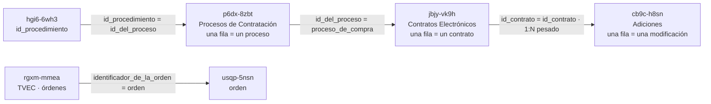

# Fuentes: datasets, unidades de análisis y joins

Lo que el servidor sabe de cada dataset vive en `registry/datasets.py`,
verificado contra la API el 18-ago-2026 y revalidado a diario por la suite de
contrato. Esta página es su lectura en prosa.

**Los IDs de Socrata rotan.** `6d52-qyqg` ya devuelve 403. Si uno deja de
responder, búscalo por nombre con `co_datos_buscar_datasets`; no lo des por
muerto.

## La unidad de análisis es lo primero

Cada dataset cuenta una cosa distinta, y sumar filas de dos de ellos produce
cifras sin significado. El servidor la repite en el sobre de cada respuesta por
esto mismo.

| Dataset | Una fila es… |
|---|---|
| `jbjy-vk9h` | un contrato |
| `p6dx-8zbt` | un proceso de compra |
| `cb9c-h8sn` | una modificación contractual |
| `qmzu-gj57` | un proveedor |
| `rpmr-utcd` | un contrato adjudicado |
| `f789-7hwg` | un proceso |
| `9sue-ezhx` | una línea del Plan Anual de Adquisiciones |
| `rgxm-mmea` | una orden de compra |
| `gdxc-w37w` | una entidad territorial |
| `xaxy-8nri` | un centro poblado |
| `vcjz-niiq` | un departamento |

Un proceso puede dar varios contratos, y un contrato puede tener muchas
adiciones: **26,1 M de adiciones para ~5,9 M de contratos**. Contar filas de
`cb9c-h8sn` no cuenta contratos modificados.

## SECOP

### `jbjy-vk9h` — SECOP II · Contratos Electrónicos

85 columnas, **~5,88 M filas**. Es el dataset central del servidor.

| Rol | Columna |
|---|---|
| Identificador | `id_contrato` (forma `CO1.PCCNTR.<n>`) |
| Entidad | `nombre_entidad`, `nit_entidad` |
| Proveedor | `proveedor_adjudicado`, `documento_proveedor` |
| Territorio | `departamento` |
| Modalidad | `modalidad_de_contratacion` |
| Fecha | `fecha_de_firma` |
| Valor | `valor_del_contrato` |
| Enlace | `proceso_de_compra`, `urlproceso` |

- `nit_entidad` es de tipo **number** aquí y **text** en `p6dx-8zbt`: no unir por
  tipo sin convertir.
- **Los contratos en estado `Borrador` están en el dataset.** No están firmados
  —no traen `fecha_de_firma` y su `valor_pagado` es 0— pero sí suman en
  `sum(valor_del_contrato)`. Si lo que quieres es contratación real, filtra por
  estado.
- `urlproceso` llega a veces como objeto JSON con clave `url`, no como cadena.

### `p6dx-8zbt` — SECOP II · Procesos de Contratación

**~9,02 M filas.** Procesos adjudicados y no adjudicados.

Ojo con los nombres: la entidad es `entidad` (no `nombre_entidad`), el
territorio es `departamento_entidad`, el valor es `precio_base` y la fecha es
`fecha_de_publicacion_del` — un slug truncado.

### `cb9c-h8sn` — SECOP II · Adiciones

**26,1 M filas.** Las modificaciones contractuales se llaman **Adiciones**:
buscar «modificaciones» en el catálogo devuelve cero. El join contra contratos
es 1:N y pesado.

Campos: `identificador`, `id_contrato`, `tipo`, `descripcion`, `fecharegistro`.

Sus campos de texto libre son los que **sí** traen el mojibake de origen
(`PRESTACIoN`, `EJECUCIoN`, `MaS`).

### `rpmr-utcd` — SECOP Integrado (I + II)

Solo adjudicados. La vista más simple para análisis que cruce las dos
plataformas. Columnas propias: `nombre_de_la_entidad`, `nit_de_la_entidad`,
`valor_contrato`, `fecha_de_firma_del_contrato`, `origen`.

Aquí viven entidades que no aparecen en `jbjy-vk9h`, como **RTVC**.

### Los demás

| ID | Qué es | Trampa |
|---|---|---|
| `qmzu-gj57` | Proveedores registrados | — |
| `f789-7hwg` | SECOP I · Procesos | Nombres de columna distintos de SECOP II |
| `9sue-ezhx` | Plan Anual de Adquisiciones | **Las columnas de fecha son `text`, no `calendar_date`: no se filtran con `between`** |
| `rgxm-mmea` | Tienda Virtual del Estado (TVEC) | El valor es `total` |

## DIVIPOLA

### `gdxc-w37w` — Municipios

**1.122 filas**: 1.103 municipios + 18 áreas no municipalizadas + 1 isla. No son
«1.122 municipios».

Campos: `cod_dpto`, `dpto`, `cod_mpio`, `nom_mpio`, `tipo_municipio`,
`longitud`, `latitud`.

- Está **atribuido a la Gobernación de Guainía**: es una republicación de
  DIVIPOLA, cuyo origen real es el DANE.
- `longitud`/`latitud` son **text con coma decimal**.
- Los nombres van en mayúsculas **con tildes**: `MEDELLÍN`.

### `xaxy-8nri` — Cabeceras y centros poblados

**8.161 filas**: 1.104 cabeceras municipales (`CM`) + 7.057 centros poblados
(`CP`). Atribución DANE, CC BY-SA 4.0, corte 30-dic-2024.

**Exactamente un registro —Medellín— trae separador de miles en la coordenada**
(`-75,581,775`), y `float(s.replace(",", "."))` lanza `ValueError` sobre él. Es
el caso que `core/coords.py` absorbe y que la suite de contrato vigila.

### `vcjz-niiq` — Departamentos

33 valores. Sin campos clave registrados: se usa como catálogo.

## Joins verificados

Disponibles como recurso MCP en `co://secop/joins`. `usqp-5nsn` y `hgi6-6wh3`
aparecen solo como destino de join: no están en el registro con unidad de
análisis propia.

Fíjate en que **la unidad de análisis cambia en cada salto**: un proceso puede
dar varios contratos y un contrato varias adiciones. Son 26,1 M de adiciones
para ~5,9 M de contratos, así que contar filas después de un join no cuenta
contratos.

**DIVIPOLA es la clave de join universal** entre fuentes territoriales, y los
códigos son **texto con ceros a la izquierda** (`05`, `08`). Tratarlos como
enteros rompe todos los joins.

## Criminalidad · MinDefensa

23 datasets con esquema idéntico: `cod_muni`, `cod_depto`, `municipio`,
`departamento`, `fecha_hecho` y `cantidad`. Verificados contra la API el
18-ago-2026. Todos vienen **ya agregados**: sin nombres, edades ni direcciones.

| Clave | ID | Desde | Casos acumulados | Una fila cuenta… |
|---|---|---|---|---|
| `abigeato` | `p88b-5ac7` | 2003 | 49.973 | una cabeza de ganado hurtada |
| `afectacion_fuerza_publica` | `8rpn-wpty` | 2010 | 25.355 | un miembro de la fuerza pública afectado |
| `delitos_ambientales` | `9zck-qfvc` | 2003 | 85.904 | un delito ambiental |
| `delitos_informaticos` | `4v6r-wu98` | 2006 | 514.987 | un delito informático |
| `delitos_sexuales` | `bz43-8ahq` | 2003 | 445.829 | una víctima de delito sexual |
| `extorsion` | `q2ib-t9am` | 2003 | 130.150 | un caso de extorsión |
| `homicidio` | `m8fd-ahd9` | 2003 | 343.680 | una víctima de homicidio |
| `homicidio_transito` | `uav5-b85g` | 2003 | 127.172 | una víctima en accidente de tránsito |
| `hurto_comercio` | `7i2x-h5vp` | 2003 | 614.669 | un hurto a comercio |
| `hurto_financieras` | `i7h7-wmjc` | 2003 | 2.529 | un hurto a entidad financiera |
| `hurto_personas` | `4rxi-8m8d` | 2003 | 3.751.174 | un hurto a persona |
| `hurto_residencias` | `7mn7-vzqp` | 2003 | 614.669 | un hurto a residencia |
| `hurto_vehiculos` | `csb4-y6v2` | 2003 | 804.192 | un hurto de vehículo |
| `invasion_tierras` | `kvjj-d2ay` | 2003 | 16.003 | un caso de invasión de tierras |
| `lesiones` | `jr6v-i33g` | 2003 | 1.900.780 | una víctima de lesiones personales |
| `lesiones_transito` | `ntej-qq7v` | 2003 | 874.723 | una víctima lesionada en accidente |
| `pirateria_terrestre` | `sutf-7dyz` | 2003 | 10.486 | un caso de piratería terrestre |
| `secuestro` | `d7zw-hpf4` | 2003 | 10.766 | una víctima de secuestro |
| `terrorismo` | `yi5j-5fe9` | 2003 | 15.563 | un hecho terrorista |
| `trata_personas` | `95c7-mm6s` | 2003 | 6.195 | una víctima de trata |
| `violencia_intrafamiliar` | `gepp-dxcs` | 2003 | 1.619.948 | un caso de violencia intrafamiliar |
| `voladura_oleoductos` | `ec2r-4byk` | 2007 | 1.372 | una voladura de oleoducto |
| `voladura_puentes` | `m98b-cdys` | 2003 | 1.348 | una voladura de puente o vía |

`cod_muni` es la clave DIVIPOLA, así que el cruce con geometría o con cualquier
otra fuente territorial es **por código**, sin pasar por el nombre.

### Los 14 datasets que quedan fuera, y por qué

MinDefensa publica **37** con este mismo esquema. Los otros 14 son operativos
del Estado —incautaciones, erradicación, aspersión, minas intervenidas, capturas
por minería ilegal, destrucción de infraestructura— y **no comparten unidad**:

- En `ERRADICACIÓN` (`p72f-qcvk`) la `cantidad` son **hectáreas**: la columna
  `unidad` vale `HECTAREA` en las 145.958 filas.
- En `INCAUTACIONES DE COCAÍNA` (`26zg-9p9r`) la columna `unidad` trae valores
  como `0.002` y `0.003`: son cantidades, no unidades.
- En `MINAS INTERVENIDAS` (`gr35-i7pm`) el `unidad_de_medida` es nulo en las
  15.827 filas.

Sumar eso junto a homicidios sería sumar kilos con personas, así que el registro
no los expone. Una prueba de contrato vigila que la unidad de `ERRADICACIÓN`
siga siendo hectáreas: si algún día se unificara, podrían entrar.

### Dos trampas del dato

**`HURTO A COMERCIO` y `HURTO A RESIDENCIAS` son el mismo dataset.** 613.637
filas y 614.669 casos en ambos, idénticos año por año. Uno de los dos títulos
está mal en la fuente y no hay forma de saber cuál desde los datos. **Nunca los
sumes**: duplicarías la cifra de hurtos. Ambos llevan la nota en el registro y
hay contrato que lo comprueba.

**`cantidad` no siempre vale uno.** Un hecho puede tener varias víctimas:
homicidio tiene 342.971 filas y 343.680 víctimas; violencia intrafamiliar,
665.687 filas y 1.619.948 casos. Se suma `cantidad`, nunca se cuentan filas.

## Cadenas de atribución

El facet `attribution` de la Discovery API solo acepta el literal completo:
`attribution=DANE` devuelve cero. `co_datos_buscar_datasets` traduce estas
siglas, y el recurso `co://atribuciones` las expone.

| Sigla | Cadena literal exacta |
|---|---|
| `DANE` | `Departamento Administrativo Nacional de Estadísticas - DANE, Bogotá D.C.` |
| `CCE` | `Agencia Nacional de Contratación Pública - Colombia Compra Eficiente, Bogotá D.C.` |
| `MinDefensa` | `Ministerio de Defensa Nacional - MinDefensa, Bogotá D.C.` |
| `Fiscalía` | `Fiscalía General de la Nación, Bogotá D.C.` |
| `MinTIC` | `Ministerio de Tecnologías de la Información y las Comunicaciones - MinTIC, Bogotá D.C.` |

Fíjate en `Estadísticas` **en plural**: no es el nombre real de la entidad, pero
es el literal que exige el facet.

## Alias de entidad

`co_secop_resolver_entidad` traduce estas siglas a un fragmento que sí aparece
en `nombre_entidad` de `jbjy-vk9h`:

| Sigla | Fragmento |
|---|---|
| `DANE` | `DEPARTAMENTO ADMINISTRATIVO NACIONAL DE ESTADISTICA` |
| `IGAC` | `INSTITUTO GEOGRAFICO AGUSTIN CODAZZI` |
| `ICBF` | `INSTITUTO COLOMBIANO DE BIENESTAR FAMILIAR` |
| `SENA` | `SERVICIO NACIONAL DE APRENDIZAJE` |
| `INVIAS` | `INVIAS` |
| `DIAN` | `DIRECCION DE IMPUESTOS Y ADUANAS NACIONALES` |
| `ANLA` | `AUTORIDAD NACIONAL DE LICENCIAS AMBIENTALES` |
| `UNGRD` | `UNGRD` |

**INVIAS y UNGRD figuran con su sigla y nada más.** Expandirlas a su razón
social daba cero; es el error que la suite de contrato vigila a diario.
