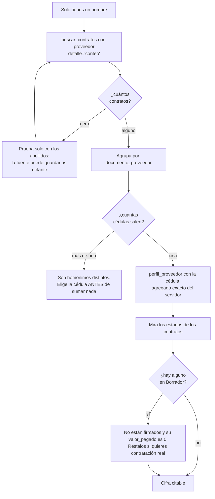

# Recetas

Secuencias que funcionan, con las trampas que tiene cada una. Todas las cifras
de esta página se obtuvieron ejecutándolas contra la fuente.

Dos reglas que atraviesan todo:

1. **Cuenta antes de traer.** `detalle="conteo"` cuesta ~200 tokens; un volcado
   de filas, miles. Y el conteo te dice si el filtro está bien antes de gastar.
2. **Para cifras agregadas usa las herramientas de agregación**, no sumes filas.
   Solo puedes sumar con seguridad cuando el sobre dice `devueltos == total`.

---

## Contratos de una persona natural

El caso incómodo: solo tienes un nombre. Cada rombo de aquí es un sitio donde se
puede dar por buena una cifra equivocada.



```
co_secop_buscar_contratos(proveedor="Jhon Sebastian Chaparro Carmona",
                          detalle="conteo")
→ 12 contratos
```

**La trampa del orden.** El filtro busca la cadena completa como subcadena. Si
la fuente registra a la persona como `CHAPARRO CARMONA JHON SEBASTIAN`, buscar
el nombre en orden natural devuelve cero. Si el conteo sale 0, prueba solo con
los apellidos:

```
co_secop_buscar_contratos(proveedor="chaparro carmona", detalle="conteo")
→ 36 contratos    ← incluye otros homónimos de apellido
```

**Confirma que es una sola persona.** Nombres iguales con cédulas distintas se
mezclan sin avisar. Agrupa por documento:

```
co_datos_agregar(dataset_id="jbjy-vk9h",
                 agrupar_por="documento_proveedor",
                 metricas="count(*) as contratos, sum(valor_del_contrato) as valor",
                 donde="upper(proveedor_adjudicado) like '%JHON SEBASTIAN CHAPARRO CARMONA%'")
→ una sola fila: 1032472802 · 12 contratos · $547.285.071
```

**Con la cédula, usa el perfil.** Es exacto y agrega del lado del servidor:

```
co_secop_perfil_proveedor(documento="1032472802")
→ 12 contratos · $547.285.071, desglosado por entidad contratante
```

**Antes de citar el total, mira los estados.** En este caso el contrato de mayor
valor ($93.192.634, ANLA) está en `Borrador`: no está firmado, no tiene
`fecha_de_firma` y su `valor_pagado` es 0 — pero sí suma en el total. La cifra
de contratación real baja a unos $454 millones.

---

## Contratos de una entidad

Nunca busques por el nombre que crees que tiene. Resuélvelo primero:

```
co_secop_resolver_entidad(nombre="invias")
→ nombre canónico + NIT
```

Y luego filtra **por NIT**, que es exacto y mucho más rápido que un `like`:

```
co_secop_buscar_contratos(nit_entidad="<el NIT>", detalle="conteo")
```

Por qué importa: varias entidades se registran con su sigla y nada más, otras
llevan puntuación rara —`RADIO TELEVISION NACIONAL DE COLOMBIA.` con punto
final— y otras no están en el dataset de contratos en absoluto.

---

## Totales por territorio o dimensión

No traigas filas para sumar:

```
co_secop_agregar(agrupar_por="departamento", metrica="valor", limite=10)
```

`agrupar_por` admite `departamento`, `entidad`, `modalidad`, `proveedor`,
`sector`, `tipo`, `estado`. Para cualquier otra dimensión, baja a
`co_datos_agregar` sobre `jbjy-vk9h`.

Acota siempre que puedas: una agregación sin filtro hace *full scan* sobre 5,9 M
de filas y puede agotar el tiempo. El sobre lo advierte.

**Los montos son nominales.** Comparar $575.132 de 2018 con $93 millones de 2026
no dice nada sin deflactar.

### Y antes de dar una suma de dinero, acótala

```
co_secop_agregar(agrupar_por="departamento", metrica="valor")
```

devuelve cifras dominadas por errores de digitación: **9 contratos aportan el
94 % de la suma** de todo SECOP II. El servidor te lo advierte con los números
de tu filtro, pero no decide por ti.

Lo que **no** funciona es filtrar por estado. Aunque el 97 % de los atípicos
está en `Cancelado` o `Borrador`, los 83 que sobreviven siguen arrastrando el
total. Lo que funciona es acotar por magnitud:

```
co_secop_buscar_contratos(valor_max=1000000000000, detalle="conteo")
→ 5.955.101 contratos · $997,5 billones
```

O medir lo que de verdad se movió, que en los atípicos es cero:

```
co_datos_agregar(dataset_id="jbjy-vk9h", agrupar_por="departamento",
                 metricas="sum(valor_pagado) as pagado",
                 donde="valor_pagado > 0")
→ 2.826.295 contratos · $251,6 billones
```

---

## La historia completa de un contrato

```
co_secop_detalle_contrato(id_contrato="CO1.PCCNTR.9003698")
```

Una llamada devuelve el contrato, sus modificaciones y la URL pública de
verificación en `community.secop.gov.co`.

Distingue tres respuestas que se parecen y no son lo mismo:

- *«Sin modificaciones registradas»* — se consultó y no hay.
- *«No se pudieron consultar las adiciones: la fuente falló»* — no se sabe.
- `[NO_ENCONTRADO]` — el contrato no existe.

---

## Explorar un dataset que no conoces

```
co_datos_buscar_datasets(consulta="...", entidad="DANE")
co_datos_describir_dataset(dataset_id="<id>")     ← SIEMPRE antes de filtrar
co_datos_consultar(dataset_id="<id>", detalle="conteo", donde="...")
co_datos_consultar(dataset_id="<id>", detalle="resumen", limite=20)
```

El paso de esquema no es opcional: los nombres técnicos vienen truncados y sin
acentos, y `valor_pendiente_de` es «Valor Pendiente de Amortizacion». Sin el
nombre legible no hay forma de adivinarlo.

Si `entidad` es una de las siglas conocidas, el servidor la traduce a la cadena
de atribución literal. Con cualquier otra, pásala completa: el facet no acepta
fragmentos.

---

## Cruzar con territorio

```
co_geo_divipola(consulta="Medellin")        → cod_mpio 05001 + coordenadas
```

Escribe el nombre con tilde o sin ella, da igual. Y **conserva el código como
texto**: `05001` con el cero delante. Convertirlo a entero rompe el join contra
cualquier otra fuente territorial.

Para auditar la calidad de las coordenadas oficiales:

```
co_geo_cotejar_coordenadas(limite=15)
→ 1.122 municipios cotejados, 1.104 cabeceras, discrepancias > ~1 km
```

Una discrepancia grande no implica error: las áreas no municipalizadas y los
municipios con cabecera trasladada aparecen ahí legítimamente.

---

## Sacar los datos del servidor

**Para procesarlos en un cliente MCP**, no hace falta pedir nada: toda respuesta
lleva `datos` y `_meta` por el canal estructurado del protocolo, con las filas ya
tipadas. Las coordenadas llegan como `float`, no como el texto con coma decimal
del origen.

**Para copiar y pegar**, pide el formato:

```
co_secop_buscar_contratos(departamento="Chocó", limite=100, formato="csv")
```

El cuerpo sale en un bloque cercado, así que se copia limpio; el sobre sigue
debajo con la procedencia y la URL reproducible.

**Para volúmenes**, exporta a disco. Pagina hasta agotar el filtro, así que no
está sujeto al presupuesto de tokens:

```
co_datos_exportar(dataset_id="jbjy-vk9h", nombre_archivo="contratos_choco",
                  donde="departamento = 'Chocó'", max_filas=50000)
```

Tres cosas que conviene saber:

- Es la **única herramienta que escribe**, y el fichero va siempre bajo
  `CO_EXPORT_DIR`. `nombre_archivo` es un nombre, no una ruta.
- Si se alcanza `max_filas` antes que el total, **el fichero queda incompleto y
  la respuesta lo dice**. Compruébalo antes de analizar lo exportado.
- El CSV lleva BOM para Excel. Con pandas: `encoding="utf-8-sig"`.

## Comparar de un vistazo

Las agregaciones traen barras proporcionales a la métrica:

```
co_secop_agregar(agrupar_por="modalidad", metrica="contratos", limite=6)
```

```markdown
| modalidad | contratos | valor total | gráfica |
|---|---|---|---|
| Contratación directa | 4.544.193 | $3.931.378.721.213.195.485.184 | ████████████████ |
| Contratación régimen especial | 796.794 | $277.323.984.716.490.637.312 | ██▊ |
| Mínima cuantía | 330.244 | $85.835.936.664.481.520 | █▏ |
| Contratación Directa (con ofertas) | 77.176 | $873.112.811.754.116.349.952 | ▎ |
| Selección Abreviada de Menor Cuantía | 60.014 | $1.347.211.323.950.801.408 | ▎ |
| Selección abreviada subasta inversa | 52.877 | $70.054.914.734.920.672 | ▏ |
```

La lectura salta a la vista: la contratación directa son **4,5 de los 5,9
millones** de contratos de SECOP II, tres cuartas partes del total.

Comparten escala, así que un grupo que llene la barra mientras el resto queda en
`▏` no es un defecto de dibujo: ese grupo domina por uno o dos órdenes de
magnitud. **Cuando eso pase con `metrica="valor"`, sospecha de los datos antes
que de la realidad** — así se descubrieron los 3.452 contratos con valores
imposibles que aportan el 99,99998 % de la suma de SECOP.

Fíjate en la tabla de arriba: la columna `valor total` ya lo enseña sin barras.
«Mínima cuantía» tiene 330.244 contratos y suma menos que «Contratación Directa
(con ofertas)», que tiene 77.176. No es que sean más caros: es el ruido.

Se apagan con `grafica=false`, y no aparecen si pides `formato="csv"`.

---

## Leer el sobre

Todas las respuestas terminan igual:

```
**12 fila(s)** de **12** coincidencias · orden: `valor_del_contrato DESC`
Fuente: `jbjy-vk9h` SECOP II - Contratos Electrónicos · CC BY-SA 4.0
Consulta reproducible: https://www.datos.gov.co/resource/jbjy-vk9h.json?...
> Unidad de análisis: un contrato. No sumes filas de datasets distintos.
```

Qué mirar, en orden:

| Señal | Qué significa |
|---|---|
| `devueltos == total` | Tienes el conjunto completo. Puedes sumar. |
| `devueltos < total` | Estás viendo una parte. **Usa agregación para cualquier cifra.** |
| `truncado: true` | No cupo en el presupuesto. Refina el filtro; no pagines a ciegas. |
| `Siguiente página: offset=N` | Usa ese `N`, no la suma de tus límites. |
| `orden: …` | Sin esto, «los 20 primeros» no quiere decir nada. |
| `Consulta reproducible` | Pégala en el navegador y verifica. Es la prueba. |

Y distingue siempre **cero filas** de **fuente caída**: son mensajes distintos a
propósito. Un error `[FUENTE_CAIDA]` nunca significa «no hay datos», y una tabla
vacía nunca es un fallo.

Cuando un término no existe en la fuente, el servidor te lo dice con esas
palabras en vez de devolver una tabla vacía.
